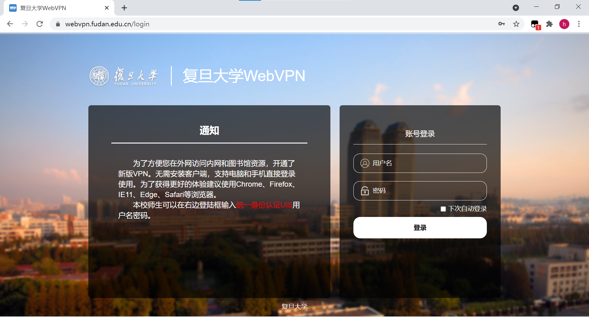
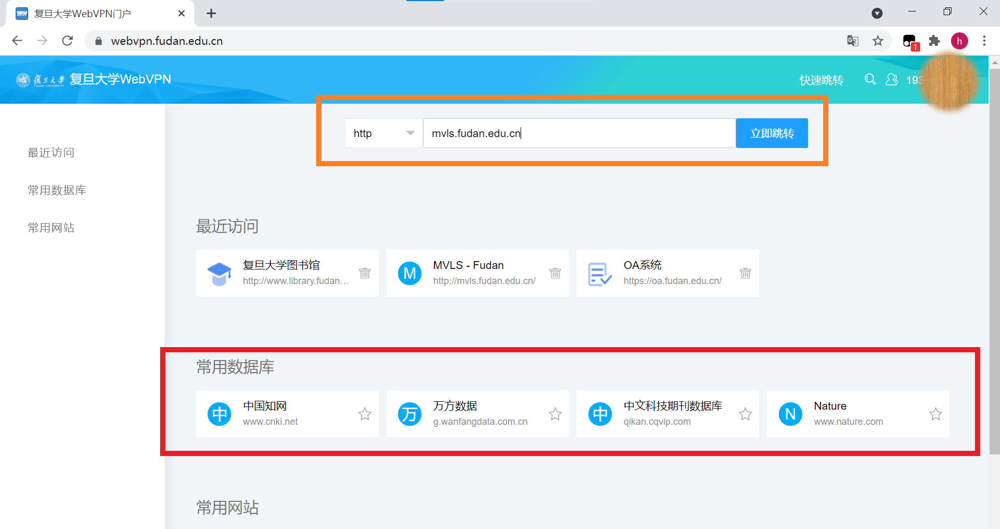
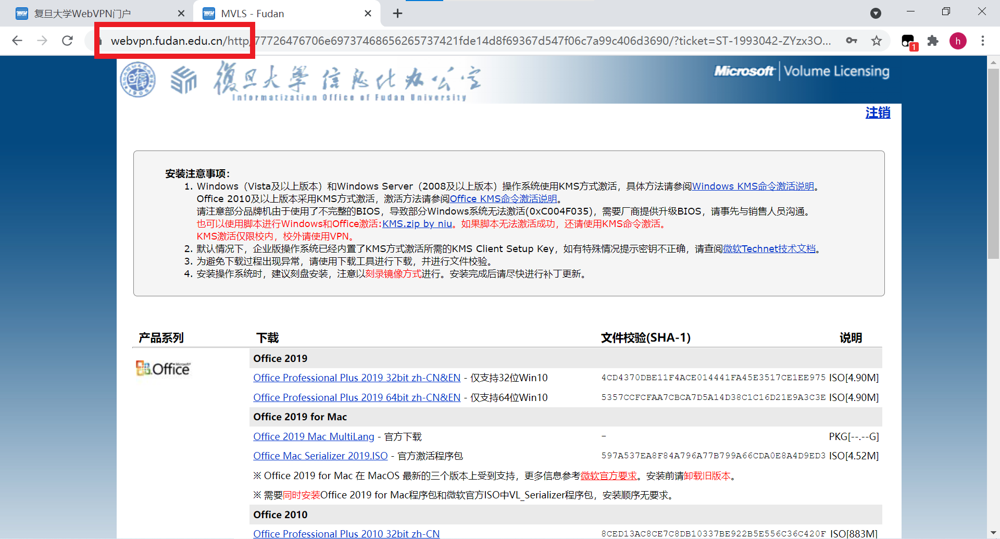
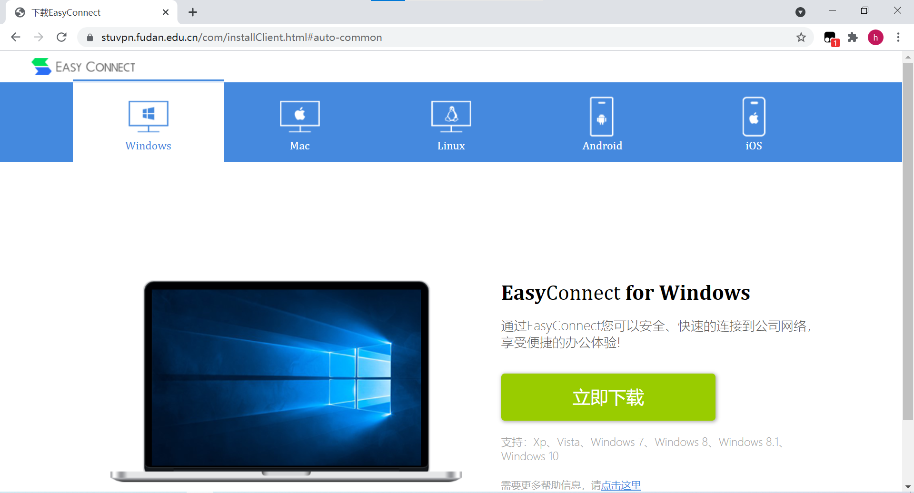
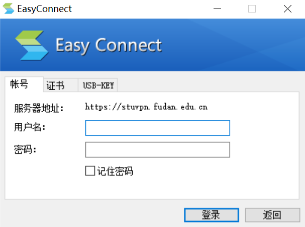
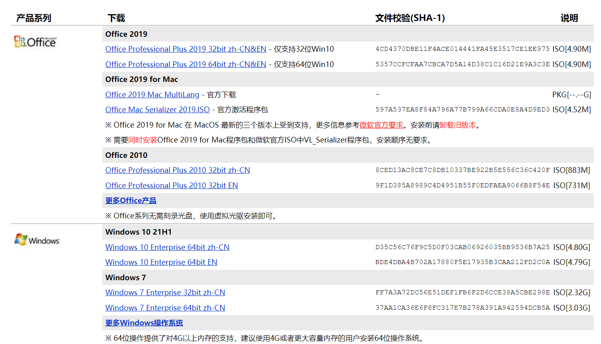
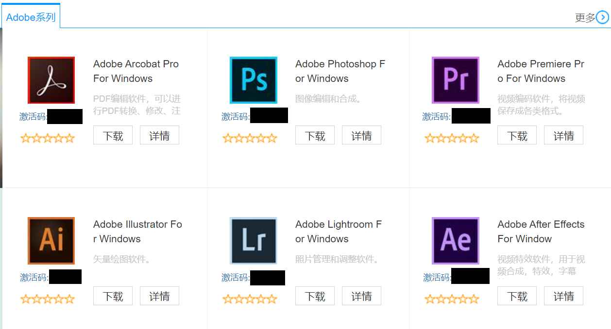

<!-- START doctoc generated TOC please keep comment here to allow auto update -->
<!-- DON'T EDIT THIS SECTION, INSTEAD RE-RUN doctoc TO UPDATE -->
**Table of Contents**  *generated with [DocToc](https://github.com/thlorenz/doctoc)*

- [校园网VPN的使用与正版软件的下载](#%E6%A0%A1%E5%9B%AD%E7%BD%91vpn%E7%9A%84%E4%BD%BF%E7%94%A8%E4%B8%8E%E6%AD%A3%E7%89%88%E8%BD%AF%E4%BB%B6%E7%9A%84%E4%B8%8B%E8%BD%BD)
  - [校园网VPN的下载与使用-访问校内资源必备](#%E6%A0%A1%E5%9B%AD%E7%BD%91vpn%E7%9A%84%E4%B8%8B%E8%BD%BD%E4%B8%8E%E4%BD%BF%E7%94%A8-%E8%AE%BF%E9%97%AE%E6%A0%A1%E5%86%85%E8%B5%84%E6%BA%90%E5%BF%85%E5%A4%87)
    - [使用WebVPN连接到校园网](#%E4%BD%BF%E7%94%A8webvpn%E8%BF%9E%E6%8E%A5%E5%88%B0%E6%A0%A1%E5%9B%AD%E7%BD%91)
    - [使用EasyConnect客户端连接到校园网](#%E4%BD%BF%E7%94%A8easyconnect%E5%AE%A2%E6%88%B7%E7%AB%AF%E8%BF%9E%E6%8E%A5%E5%88%B0%E6%A0%A1%E5%9B%AD%E7%BD%91)
  - [正版软件的下载](#%E6%AD%A3%E7%89%88%E8%BD%AF%E4%BB%B6%E7%9A%84%E4%B8%8B%E8%BD%BD)

<!-- END doctoc generated TOC please keep comment here to allow auto update -->

# 校园网VPN的使用与正版软件的下载

## 校园网VPN的下载与使用-访问校内资源必备

众所周知，学校的网络是分为**校园网**和**外网**的。学校的网络中有部分资源（比如图书馆、正版软件）是**只能在校园网下访问**的。此外，如果遇到学校**网络维护调试**的时候，部分日常可以在校外访问的网页（比如ehall，教务处）也需要在内网下才能访问。

如果你在校园中的教学楼等地方连**接上了iFudan、iFudanNG1X等学校提供的Wi-Fi**，那么你就已经连接到了**校园网**。

如果你在**寝室**里，或者寒暑假回家使用**家里**的网络，那么你是处于**外网**中的。此时，你无法访问图书馆，正版软件等需要在校园网才能访问的资源。在这种情况下，你需要使用**VPN连接到校园网**，才能够正常使用部分资源。

目前，有两种不同的方式可以使用学校提供的VPN连接到校园网。分别是WebVPN和EasyConnect客户端。本文接下来就分别介绍这两种方式。

### 使用WebVPN连接到校园网

首先你需要有一个UIS账号和密码。UIS账号为你的学号，密码可以根据新生手册中的教程自行设置。

在浏览器中打开[复旦大学WebVPN](https://webvpn.fudan.edu.cn)，看到如下界面。在右侧输入你的学号和UIS密码。

登录后，看到如下界面，为**校园网VPN门户**。使用WebVPN时，访问校内资源**都需要从此门户发起请求**。

可以看到下方和左侧已经列出了常用网站的入口。如果需要访问其他的校内网站，可以在上方的输入框内输入（比如输入mvls.fudan.edu.cn访问正版软件下载页面）。

可以看到访问成功，浏览器的地址栏中显示的地址已经带上了webvpn.fudan.edu.cn的前缀。

### 使用EasyConnect客户端连接到校园网

**不想每次都从WebVPN的门户首页发起请求**？你还可以使用EasyConnect客户端连接到校园网。

访问[stuvpn.fudan.edu.cn]()，输入学号和密码后，系统自动跳转到EasyConnect的下载界面。选择对应的版本进行下载安装。安装过程中，**如果有杀毒软件提示，请点击“允许”。**

安装后启动EasyConnect，在服务器地址处填写[stuvpn.fudan.edu.cn]()（如果没有自动填好的话）。输入学号和密码，**点击登录即可连接成功访问校园网。**

## 正版软件的下载

学校为我们提供了一些正版软件的资源。比较常用的有Microsoft Windows，Mircosoft Office及Adobe全家桶。此外还有提供VMWare，SPSS，SAS，Matlab等正版专业软件。

下载学校提供的正版软件**需要连接到校园网**。如果你想在寝室或者家里下载安装正版软件，请参考上面的教程使用VPN连接到校园网。

可以用学号和密码登录[MVLS-Fudan](http://mvls.fudan.edu.cn/)下载到Windows和Office。

可以用学号和密码登录[正版软件平台](https://zb.fudan.edu.cn/)下载到Adobe全家桶。

关于下载完Windows，Office和Adobe等软件后如何进行下载和激活，由于篇幅较长，再次暂且不表。后续PCS会另外**专门推出一期教程指导如何安装和激活**，敬请期待。如果自行下载安装遇到困难也可以来值班室找我们（
