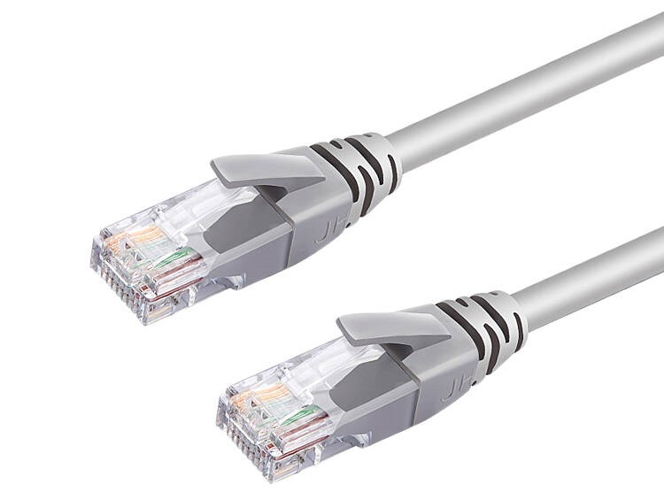

<!-- START doctoc generated TOC please keep comment here to allow auto update -->
<!-- DON'T EDIT THIS SECTION, INSTEAD RE-RUN doctoc TO UPDATE -->
**Table of Contents**  *generated with [DocToc](https://github.com/thlorenz/doctoc)*

- [寝室上网指南](#%E5%AF%9D%E5%AE%A4%E4%B8%8A%E7%BD%91%E6%8C%87%E5%8D%97)
  - [购买宽带](#%E8%B4%AD%E4%B9%B0%E5%AE%BD%E5%B8%A6)
  - [购买宽带后](#%E8%B4%AD%E4%B9%B0%E5%AE%BD%E5%B8%A6%E5%90%8E)
  - [选购路由器](#%E9%80%89%E8%B4%AD%E8%B7%AF%E7%94%B1%E5%99%A8)
  - [路由器的安装与配置](#%E8%B7%AF%E7%94%B1%E5%99%A8%E7%9A%84%E5%AE%89%E8%A3%85%E4%B8%8E%E9%85%8D%E7%BD%AE)
    - [网线](#%E7%BD%91%E7%BA%BF)
    - [连接路由器](#%E8%BF%9E%E6%8E%A5%E8%B7%AF%E7%94%B1%E5%99%A8)
    - [配置路由器](#%E9%85%8D%E7%BD%AE%E8%B7%AF%E7%94%B1%E5%99%A8)
    - [如果你遇到问题](#%E5%A6%82%E6%9E%9C%E4%BD%A0%E9%81%87%E5%88%B0%E9%97%AE%E9%A2%98)
  - [尾注](#%E5%B0%BE%E6%B3%A8)

<!-- END doctoc generated TOC please keep comment here to allow auto update -->

# 寝室上网指南

**首先你要购买宽带！**

**首先你要购买宽带！**

**首先你要购买宽带！**

## 购买宽带

在报到的那几天，校园里会有很多办理宽带的摊位。同学可以看看自己的寝室楼有哪家运营商提供的宽带服务，带上自己的身份证，去对应的摊位购买即可。

以下是御三家的宽带信息。由于本文写作时信息办网上提供的信息仍是2020年的，因此以下信息可能会过时，请同学们以报道时最新的信息为准~

[电信](http://www.ecampus.fudan.edu.cn/2329/list.htm) [移动](http://www.ecampus.fudan.edu.cn/2337/list.htm) [联通](http://www.ecampus.fudan.edu.cn/2333/list.htm)

## 购买宽带后

如果同学购买的是移动的宽带，那么你的寝室楼内应该能找到ifudan.stu的Wi-Fi，可以直接用手机和电脑连接，在浏览器中输入移动给你的账号密码验证后即可上网。如果能找到移动为你提供的Wi-Fi，在寝室里购买和安装路由器就**不是必须的**，你可以直接**关闭本文**。当然，你也可以选择安装一个，安装后验证一次，只要路由器不重启就无需再次进行验证。

如果同学购买的是电信的宽带，那么你需要一个路由器用来发射Wi-Fi，供你的手机/电脑/平板/智能手表......进行无线上网。

## 选购路由器

使用路由器可以将网络进行共享。这样只要寝室里购买一份宽带，安装一台路由器，寝室里的大家都可以上网。

选购路由器时，**强烈建议购买支持5Ghz频段的路由器**，而不推荐购买仅支持2.4Ghz频段的路由器（笔者曾在寝室在寝室使用过仅支持2.4Ghz频段的路由器，经常断网，更换路由器后遂解决）。

这是因为大学寝室人口密度较大，无线设备非常多，**易互相产生干扰**。而5Ghz的路由器信号频宽较宽，无线环境比较干净，**干扰少，网速稳定，且可以支持更高的无线速率，可以提供更好的上网体验**。当然5G Wi-Fi也有缺点，那就是**穿墙能力较弱**。但是大家在宿舍根本就没有穿墙需求，哈哈哈。

在选购路由器时，如果你在看到【5G】【双频】【千兆】及其他的类似字样，说明这台路由器支持5Ghz频段。以下是在京东上支持5Ghz频段的路由器的两个例子（不一定真的要购买这两款，只要是5G双频的路由器都是可以的！）。

此外，选购路由器时建议选择知名品牌的路由器（比如TP-LINK,FAST,MERCURY,腾达,小米,华为等，此处无法一一列举，请自行甄别），**不建议购买无品牌的路由器或杂牌路由器**。

## 路由器的安装与配置

### 网线

首先你得有**至少一条网线**，有可能购买路由器的时候会随机附赠。如果没有附赠，几元钱也能买一条。网线两端的接口如下所示。如果你在安装路由器后，还想有线上网的（而不是使用Wi-Fi），那么你可能需要更多的网线。

### 连接路由器

这部分教程主要介绍如何连线。一般适用于大多数路由器型号。

首先插上路由器的电源。将网线的一端插入书桌下面的网口，另一端插入路由器背面的WAN口。如下图所示 ：

（注意网线接口是有正反的，大力出奇迹是没有用的！）

如果你在安装路由器后，还想让电脑有线上网（~~打游戏的时候用有线连接更稳定一些~~），可以如上图所示，将路由器的LAN口和你的电脑连接起来~

### 配置路由器

这里以一台TP-LINK TL-WDR5620为例，介绍路由器的配置操作。注意，由于不同园区的宽带上网方式可能不太一样，以下教程可能不一定适合所有的同学。遇到问题的话希望大家能灵活变通，解决问题~

首先，按照上述教程物理连接完路由器后，你会看到有一个没有密码的Wi-Fi。此Wi-Fi的名字应该有印刷在你的路由器外壳或者路由器的包装上，因此你可以判断这是不是你的路由器发出的Wi-Fi。确认完这是你的Wi-Fi后，进行连接。

打开浏览器，输入192.168.1.1（一般是这个，不对的话请参考说明书）进入路由器设置界面。

按照提示配置【管理员密码】，当且仅当你拥有路由器的管理员密码，才可以访问路由器的管理界面对路由器进行管理，比如修改Wi-Fi的密码。如果管理员密码忘了，就只能将路由器恢复出厂设置来清除管理员密码了。设置完后点击下一步。

进入【上网设置】。一般有三种选项，分别是【自动获取IP地址】、【宽带拨号上网（PPPOE）】和【固定IP地址】。笔者所住的南区8号楼电信是使用的PPPOE上网方式。如果大家有从运营商处获得PPPOE的账号密码，此处就选择【宽带拨号上网（PPPOE）】，否则一般选择【自动获取IP地址】。具体选择哪个应该也可以在运营商处提供的资料上找到。

使用移动宽带的同学，在此处配置好后（应该是自动获得IP地址），可能在能真正上网前，还需要在浏览器中进行一次验证。之后只要不重启路由器就无需再进行验证。

最后我们对【路由器发射出来的Wi-Fi】进行设置。在此处设置你喜欢的Wi-Fi名字和密码。

此外，如果路由器支持Wi-Fi多频合一的话，也建议打开。

设置完后点击确定。路由器可能将会重启，稍等一会后你会发现你的Wi-Fi**已经不是开放**的了。你需要用你**刚才设置好的密码**连接你的Wi-Fi，如果连接后手机/电脑能够成功打开~~联网检测工具~~**百度**，说明设置成功。

### 如果你遇到问题

由于不同园区或不同路由器的情况可能不同，如果你在安装和配置路由器的过程中遇到问题，可以：

1.【打电话咨询】宽带提供商。咨询的时候可以具体地描述你在哪一步遇到了问题，有没有什么错误提示等，能更快地解决问题。

2.善用【搜索引擎】，同样具体描述你在哪一步遇到了问题，具体的错误提示之类的信息。

3.看看你的【邻居】里有没有大佬成功了，问问他怎么操作的，或者让他来帮你操作一下（bushi）。

## 尾注

1.本文仅供简单科普之用，希望能帮助各位新同学更快地让宿舍通上网络。如有错漏之处，请在本公众号后台回复，还望海涵。

2.笔者和PCS不对阅读本文后产生的购买行为负责。

3.PCS目前正在进行新学期的招新。[如果你想加入我们，请点击这里。](http://mp.weixin.qq.com/s?__biz=MjM5MTAyNTcwOQ==&mid=2649712845&idx=1&sn=19b84328b89775132e3dda6ef0de4151&chksm=bea0178f89d79e99614114060475eaacb3483963eb8df18a19982a0ff7d895c9bf754260b139&scene=21#wechat_redirect)PCS欢迎你的加入！