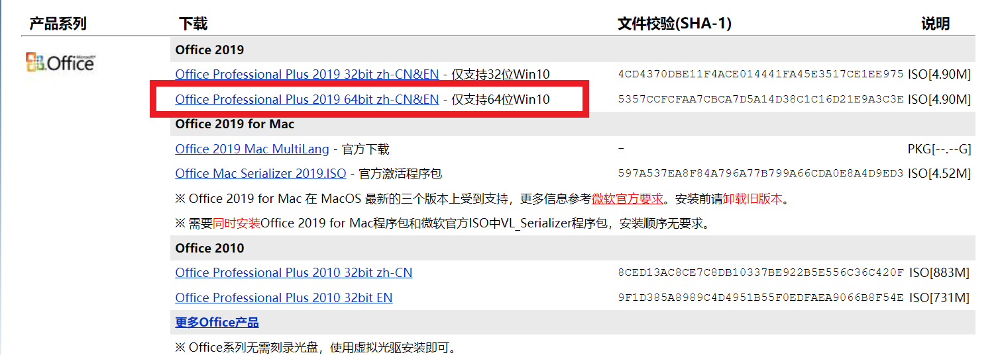
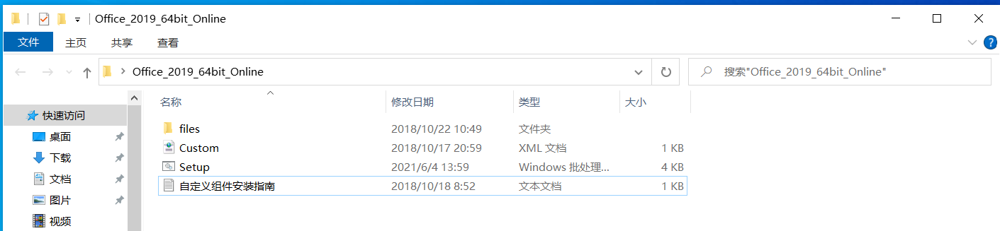
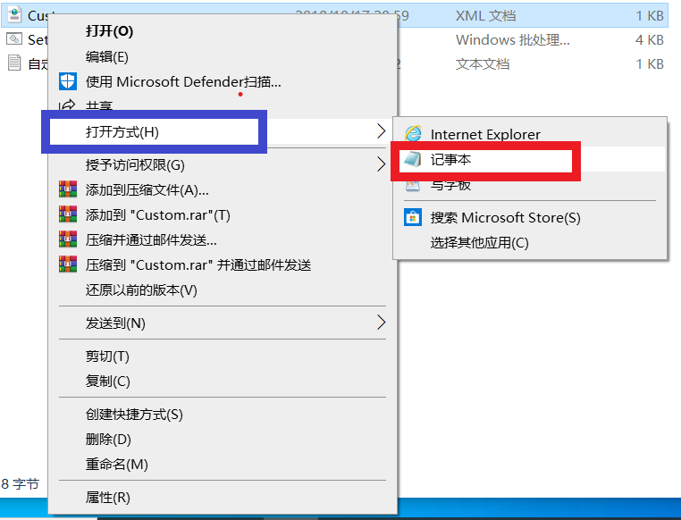
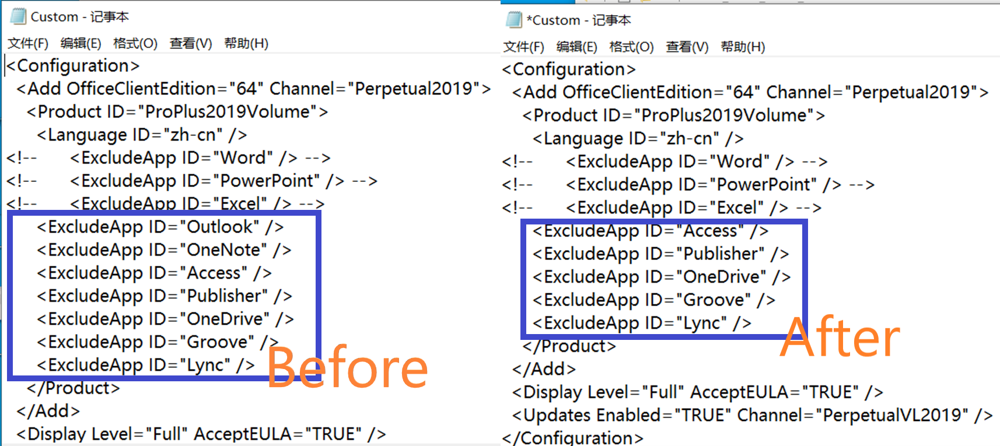
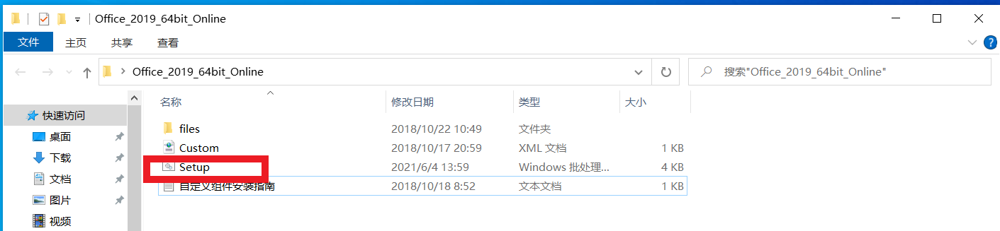
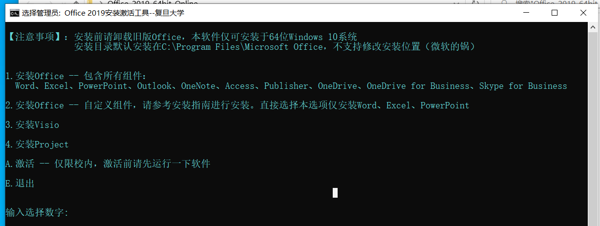
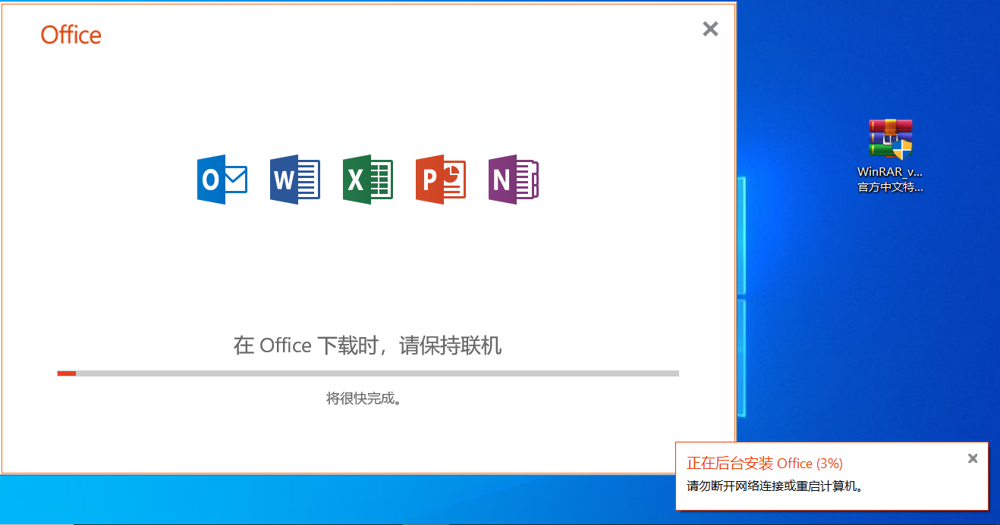
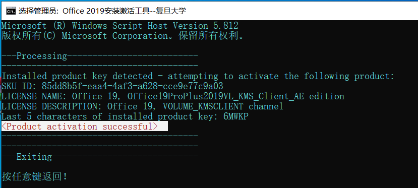
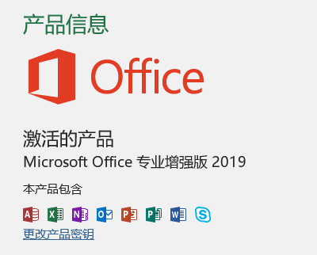

# 下载与安装Microsoft Office

## 前情提要

在~~Pre大学~~复旦大学学习，绕不开的两件事就是**做Pre**和**写期末论文**，Microsoft Office便是大家最常用的软件之一。今天PC Service就为大家带来为复旦大学量身定做的Microsoft Office安装教程。

以下教程均基于学校提供的正版Office Professional Plus 2019，下载、安装和激活都需要**在校园网内进行**，校外须使用**VPN**。

此外，在安装之前，请先**彻底卸载掉电脑内的旧版/其他版本的Microsoft Office软件**（WPS不要紧），同时安装多种版本的Microsoft Office可能会导致不可预料的错误。

## 下载

用浏览器打开校内下载正版软件的平台[MVLS-Fudan](http://mvls.fudan.edu.cn)(mvls.fudan.edu.cn)，找到对应你的系统版本的Office进行下载。由于绝大多数的电脑都是64位的Windows10，一般下载Office Professional Plus 2019 64bit zh-CN&EN即可，如下图所示。

## 安装

### 解压安装包

下载完后，我们得到的是一个约为4.9MB的iso文件。使用诸如WinRAR之类的软件将此iso解压开来（不要用虚拟光驱装载），看到如下的文件结构。

### 自定义要安装的组件

我们都知Microsoft Office是具有非常多的组建的，比如大家最熟悉的【三剑客】（Word、PowerPoint、Excel），还有一些比较小众的组件，比如Outlook、Access等。学校提供给我们的安装程序**默认会安装Word、PowerPoint和Excel**。如果你不需要安装其他的组件，可以跳过这部分。否则，请使用记事本打开Custom.xml文件。

【关键！！！】把你**想要**的组件所在的行**删除**掉（因为是**ExcludeApp**嘛，双重否定句，呵呵），并保存。比如我还想要安装**Outlook**和**Onenote**，就对Custom.xml文件进行如下修改并保存。

### 开始安装

双击解压后得到的setup批处理文件，根据提示开始安装。**如果在安装过程中提示需要管理员权限，请点击【是】**

【输入1】安装全部组件，【输入2】安装刚才自定义的组件。

耐心等待安装完成。

## 激活

安装完成后，最后一步是需要激活你刚才安装的Office，否则它【5天还是7天】之后就会变成一个不能编辑、只能查看文档的文档查看器。

激活前请先运行一次刚安装好的Office（Word、PowerPoint。。。都可以），并**确保你连接到校园网**，不管你是真的在校内，还是校外使用VPN连接。

之后，仍然运行setup批处理文件，**这一次输入A进行激活**。

可以看到提示激活成功，再打开Office发现已经激活成功了。

#### 关于激活的注意事项

学校为我们提供的Office和Windows的激活方式是**KMS激活**。KMS激活有**180天的有效期**。但是放心，每次您连接上校园网，就会自动给您续上180天的激活有效期，**因此只要你还在学校上学，理论上激活就不应过期**。在您毕业离校之后，Office的激活状态会持续到您【**最后一次连接到校园网的180天后**】，在那之后您的激活会失效，如果您还需要使用，就得自己想办法激活了。

## 尾注

1.如果你在安装过程中遇到问题，欢迎在PCS本学期开门之后来值班室求助（具体开门时间和地点另行通知）。

2.请合理使用学校提供的正版软件，不要将其泄露给学校外面的人，以免给自己带来法律风险和给他人带来不必要的麻烦。

**3.如果你对PCS这个组织感兴趣，请持续关注本公众号【PCS服务队】，我们会在开学后一两周进行招新，具体信息也将通过公众号【PCS服务队发布】，我们期待您的加入！**